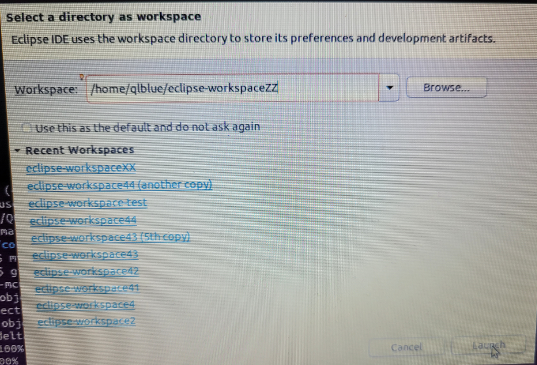
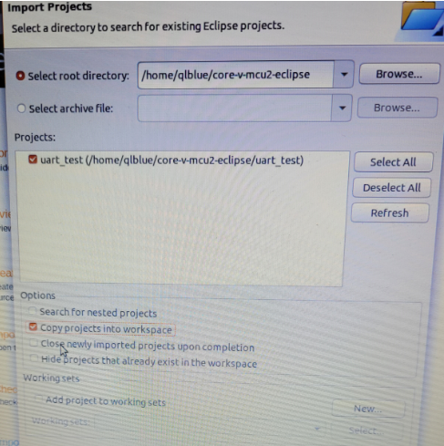
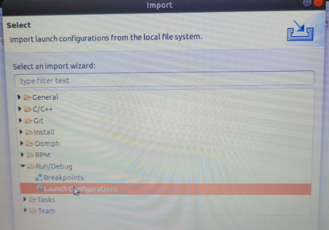
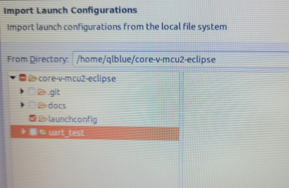
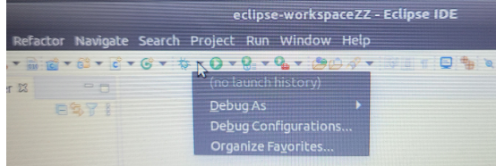
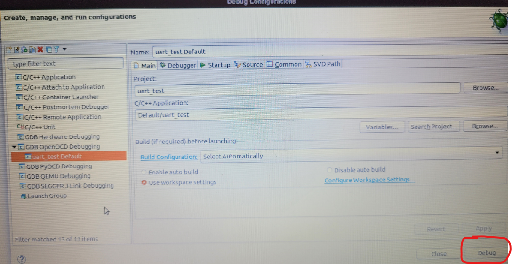

# core-v-mcu2-eclipse
Eclipse project that uses the FreeRTOS kernel and runs on core-v-mcu2
## Installation
Eclipse relies on a larger ecosystem of tools.  This project uses a particualr set of tools in a particualr set of locations.  These instructions do not cover loading the other tools, or adapting the preferences to point to differ tools or different locations.  These instructions assume that you are familar enough with Eclispe to make any required changes.
### Step 1: 
Install Eclipse (you are on your own for this step)

### Step 2: clone the core-v-mcu2-eclipse repo
~~~
git clone git@github.com:QuickLogic-Corp/core-v-mcu2-eclipse.git
~~~
### Step 3: run Eclipse, import uart_test and the launch configuration
~~~
eclipse
~~~
NOTE: importing the uart_test does not imprt the information to launch the debugger, so after importing uart_test, be sure to either import the launch configuration or create you own.
- create and launch a new workspace

- select import existing projects 

- choose repo as root directory and select uart_test project

- under file menu, import then launch configutations

- select only launchconfig 

- under debug pull down, choose 'Debug Configurations ...' 

- under GDB OpenOCD Debugging, choose uart_test Default, then click Debug

This should compile, link and load the application and stop at main waiting for you to start debugging.

## Emulation hardware
The intent is to support more than one emulation platform.
Currently only one board is supported:

* Nexys A7 100T

## Emulation bitsream
Bistreams compatible with the Nexys A7 100T can be found at:
http://quickai.quicklogic.com/

TODO: need to find a way to manage bitstream and software versions.

## Peripheral support
The type and number of peripherals supported are defined by 'pulp_soc_defines.sv'.
The information is made available to software applications as a series of #define values in the 'SOC options' section of 'target/core-v-mcu/include/core-v-mcu-config.h'.
An example configuration is:
~~~
// SOC options
#define N_IO                 48         // Total available IO
#define N_SYSIO              3
#define N_GPIO               32
#define N_UART               2          // Number of uarts
#define N_QSPIM              1          // Number of QuadSPI masters
#define N_I2CM               2          // Number of I2C masters
#define N_I2SC               0
#define N_CSI2               0
#define N_HYPER              0
#define N_SDIO               0
#define N_CAM                1
#define N_JTAG               0
#define N_MRAM               0
#define N_FILTER             1
#define N_FPGA               1
#define N_EXT_PER            0
#define N_EFPGA_TCDM_PORTS   4
#define N_FPGAIO             43
#define N_EFPGA_EVENTS       16
~~~

## uart_test example
This example writes messages to both UART0 and UART1.  UART0 is the built-in UART that is accessed via the micro-usb port on the Nexys board.  UART1 is connected to PMOD connected JB.  You can either plug in a PmodUSBUART Peripheral Module to the top row of JB, or wire any USB to serial adaptor to JB[2] and JB[3].
The messages from UART0 say 'Blinky[0]' followed by iteration number, and those from UART1 say 'Blinky[1]' followed by interation number plus 10.  An example of the output is:

