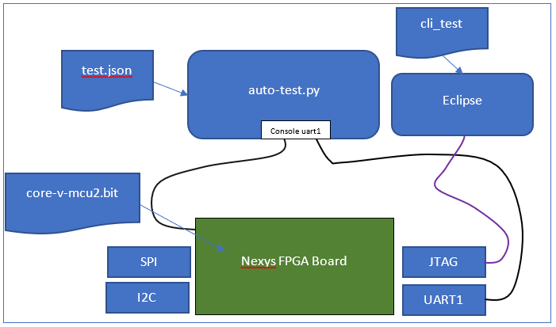

# auto-test for core-v-mcu2
The purpose of auto-test is to automate the valdation, using emulation of the core-v-mcu design.
- The emulation runs on a Nexys FPGA board.
- The appropriate bistreams (core-v-mcu2.bit) are available at quickai.quicklogic.com.
- The Eclipse cli_test project is available at https://github.com/QuickLogic-Corp/core-v-mcu2-eclipse
- The auto-test.py program is available at https://github.com/QuickLogic-Corp/core-v-mcu2-eclipse/auto-test
- Thet test script, test.json, is also avalable at  https://github.com/QuickLogic-Corp/core-v-mcu2-eclipse/auto-test

## Theory of operation

The cli_test program uses a command line interface to access various subroutines that perform specific tests.
The python program, auto-test.py, opens 2 serial ports:
- console (uart0) which is used to communicate with the CLI
- uart1 which is used to communicate with uart1
The python program reads a json file, test.json, which describes what commands to send to the CLI and what response to expect.

## Organization of cli_test program
The essential portion of the cli_test progrma is a file called cli.c (cli_test/app/cli.c).
This file defines the CLI menues, which are hierarchical, and the routines that are invoked by each command.
Groups of related tests should be collected in a submenu, so for instance all UART tests in one submenu, all memory tests in another and so forth.
The main menu points to each of the submenus:
~~~
// Main menu
const struct cli_cmd_entry my_main_menu[] = {
  CLI_CMD_SUBMENU( "uart1", uart1_tests,  "commands for uart1" ),
  CLI_CMD_SUBMENU( "mem",   mem_tests,    "commands for memory" ),
  CLI_CMD_TERMINATE()
};

// UART1 menu
const struct cli_cmd_entry uart1_tests[] =
{
  CLI_CMD_SIMPLE( "tx", uart1_tx, "<string>: write <string> to uart1" ),
  CLI_CMD_TERMINATE()
};

// mem menu
const struct cli_cmd_entry mem_tests[] =
{
  CLI_CMD_SIMPLE( "start",   mem_print_start,   "print start of unused memory" ),
  CLI_CMD_SIMPLE( "check",   mem_check,         "print start of unused memory" ),
  CLI_CMD_TERMINATE()
};
~~~
In this example, there is a submenu for UART1 tests, and another for MEM tests.
- There is a single UART1 test call **tx** that writes a string to UART1 (which the python script can read to confirm that it was sent corectly)
- There are two MEM tests:

  - **start** which simple prints the address of the first available memory location after the program (not very useful)
  - **check** which writes to every location from the **start** address to 0x1C08_0000 (512KB) and then reads those locations back to confirm that memory location exists, works and is not aliased on itself

A nice feature of the CLI is that you can directly access submenu commands by using:
~~~
submenu_name command <parameter>
~~~
## Submenu commands
The format of the CLI_CMD_SIMPLE entries in the submenus is:
- commmand name (text string)
- subroutine to call
- help message
In the example above, 'mem check', calls the mem_check subroutine:
~~~
static void mem_check(const struct cli_cmd_entry *pEntry)
{
    (void)pEntry;
    // Add functionality here
    bool  fPassed = true;
    extern char __l2_shared_end;
    uint32_t*  pl;
    for (pl = (uint32_t*)(&__l2_shared_end); (uint32_t)pl < 0x1c080000; pl++) {
      *pl = (uint32_t)pl;
    }

    // pl=0x1c070000; *pl = 76;  // Enable to force and error

    for (pl = (uint32_t*)(&__l2_shared_end); (uint32_t)pl < 0x1c080000; pl++) {
    if (*pl != (uint32_t)pl) {
      dbg_str_hex32("mem check fail at", (uint32_t)pl);
      dbg_str_hex32("read back        ", *pl);
      fPassed = false;
      break;
    }
  }
    if (fPassed) {
      dbg_str("<<PASSED>>");
    } else {
      dbg_str("<<FAILED>>");
    }
}
~~~
The first three lines are common -- all specific functionality is added below the '// Add functionality here' comment.
In this example, the routine gets the address of the first memory location after the program, '__l2_shared_end', and writes the address of each location to that location up to the expected end of memory (which is 512KB after the start of the memory).
TODO: The end address is hardwired.  It would be nice to read it from the core-v-mcu2 description.
The routine then loops over the same addresses and confirms that they contain the correct value.

If there is an error, it is reported to the DEBUG_UART (which should be assigned to the same UART as the console) using the debug print routines.
Just before exit the routine prints the overall status in a specific format so the python script can recognize it:
- \<\<PASSED>>
- \<\<FAILED>>
- \<\<DONE>>

The meaning of PASSED and FAILED is obvious. 'DONE' should be used in any routine that does not have a pass/fail criterion.  For example, the 'mem start' routine, which simply reports a memory address prints \<\<DONE>>.  The purpose of doing this is to ensure that silent errors do not get ignored.
For example, if you mistyped \<\<FAILED>> as \<\<FIALED>> then the python script would not find a match and the failure would go unnoticed.

## json script
An example json script is:
~~~
{
	"initialize" : [
		{">console"		: "exit <<DONE>>\r\n"}
	],
	"uart1" : [
		{">console"		: "uart1 tx hello\r\n"},
		{"<uart1"			: "hello\r\n"}
	],
	"mem"	: [
		{">console"		: "mem start\r\n"},
		{">console"		: "mem check\r\n"}
	]
}
~~~
### Section 1: Initialize
The first section, 'initialize', runs one command:
~~~
{">console"		: "exit <<DONE>>\r\n"}
~~~
This ">console" means write the following test to the console (CLI input).
In this example, the CLI command is "exit \<\<DONE>>\r\n", which tells the CLI to exit from a submenu if it happens to be in one (if you have just started, it won't be).  The command argument, '\<\<DONE>>' is ignored.  The purpose of including it is to get the \<\<DONE>> into the CLI output so the python script does not flag an error.  The "\r\n" must be explicitly included because the python script will treat the field as a byte array.

### Section 2: uart1
The second section, 'uart1', tests the second uart (uart0 is tested by the CLI) by running two commands.  

The first command,
~~~
{">console"		: "uart1 tx hello\r\n"},
~~~
tells the CLI to run teh **tx** command of the uart1 submenu, with argument "hello\r\n".
The **tx** command shoudl write the argument to uart1.

The second command,
~~~
{"<uart1"			: "hello\r\n"}
~~~
tells the python script to *read* from uart1, and to expect to read 'hello\r\n'.

If it doesn't read exactly 'hello\r\n' it reports FAILED.

### Section 3: mem
The third section, 'mem', runs two commands:
~~~
{">console"		: "mem start\r\n"},
{">console"		: "mem check\r\n"}
~~~
The first command writes 'mem start' to the console (CLI) which will report the address of the first available unused memory location.

The second command write 'mem check' to the console (CLI) which will perform a write/read test of all unused memory afte the program.

## auto-test.py
The python script takes two arguments:
- --console /dev/ttyUSBX (specifies which serial port connects to the console (UART0))
- --uart1 /dev/ttyUSBX (specifies which serial port connects to the UART1)

Output from the example is:
~~~
clear; python3 test.py --console /dev/ttyUSB3 --uart1 /dev/ttyUSB1

-----------------------------------
-
- core-v-mcu2 test
-
-----------------------------------
Opened console(/dev/ttyUSB3)
Opened uart1(/dev/ttyUSB1)
*** initialize ***
>>exit <<DONE>>

exit <<DONE>>
(at top)
[0] > 

*** uart1 ***
>>uart1 tx hello

uart1 tx hello
string = hello
<<DONE>>[0] > 

Got uart1: hello

<<PASSED>>
*** mem ***
>>mem start

mem start
l2_shared_end: 0x1c021b70
<<DONE>>[0] > 

>>mem check

mem check
<<PASSED>>[0] > 

   0 commands returned no status
   2 commands PASSED
   0 commands FAILED
~~~
The last three line provide the overall summary:
- '0 commands returned no status' means that every command returned some status: PASSED, FAILED or DONE
- '2 commands PASSED' means that 2 commands did real work and worked as expected
- '0 commands FAILED' means that no commands failed

The output is a bit cluttered, but with some practice it is understandable and can be used to diagnose errors.
